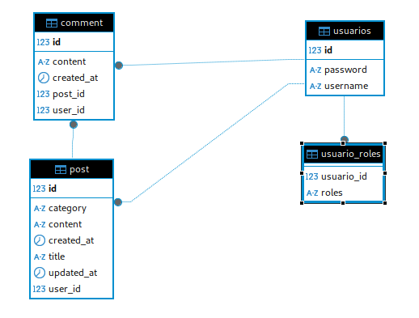
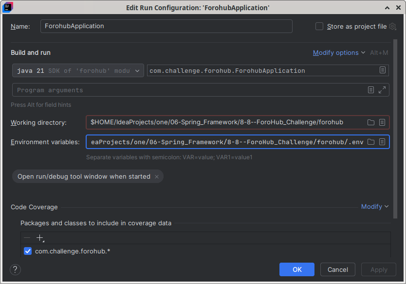
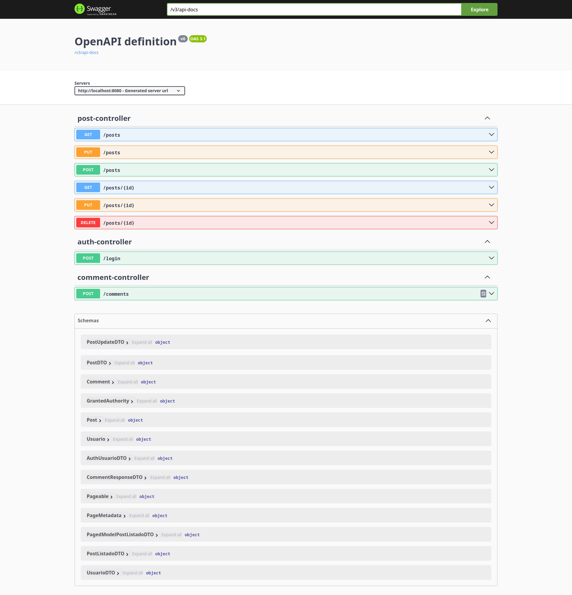
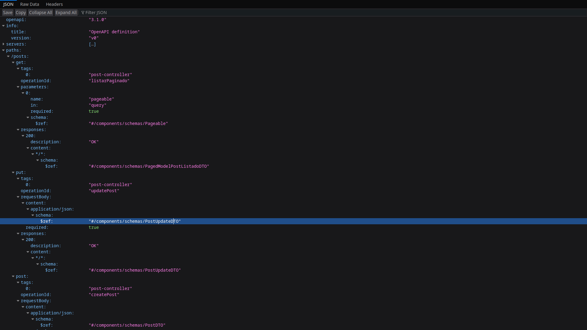
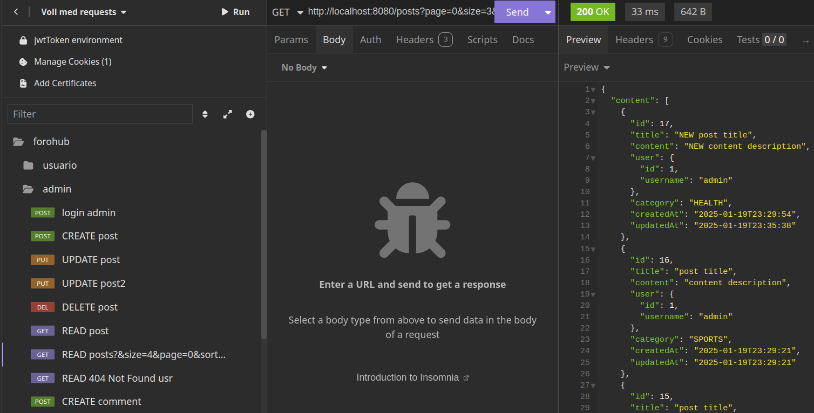

# Challenge Alura ONE - Foro Hub

## Diagrama Entidad-Relacion

### Entidades

    * usuarios
    * usuario_roles
    * comment
    * post



## Requerimientos

    * Base de datos Relacional MariaDB
    * CRUD de Post
    * Implementacion de Spring Security
    * Implementacion de JWT
    * Integracion de documentacion en Swagger

## Pasos Iniciar el Programa

1. Creacion del .env

```
DB_URL=
DB_USER=
DB_PASS=
JWT_SECRETKEY=
```

2. Configuracion del application.properties

```properties
spring.application.name=forohub
#
jwt.secretKey=${JWT_SECRETKEY}
#
# DB connection
spring.datasource.url=jdbc:mariadb://${DB_HOST}/forohub
spring.datasource.username=${DB_USER}
spring.datasource.password=${DB_PASSWORD}
#
spring.datasource.driver-class-name=org.mariadb.jdbc.Driver
#
# hibernate options
spring.jpa.hibernate.ddl-auto=update
```

3. Configurar en las variables de entorno en los perfiles de configuracion en IntelliJ IDEA



## Swagger




## Insomnia


